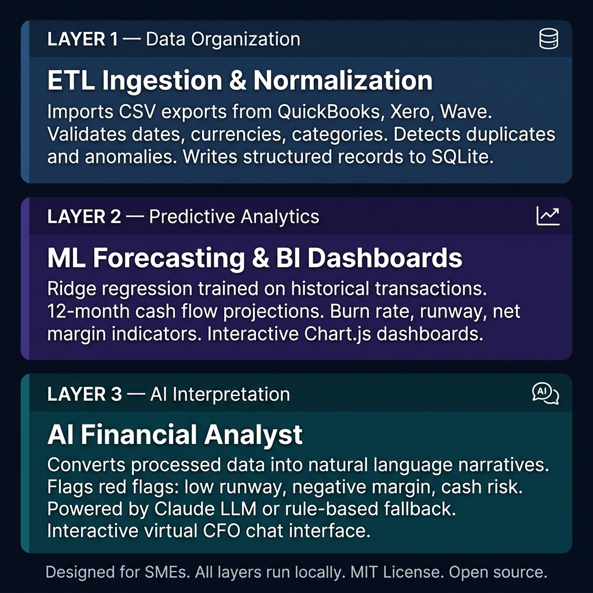
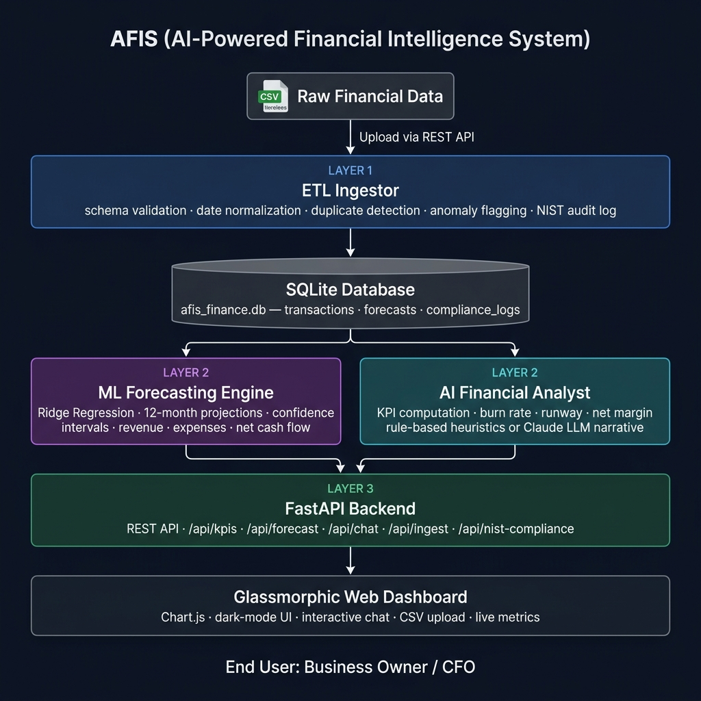
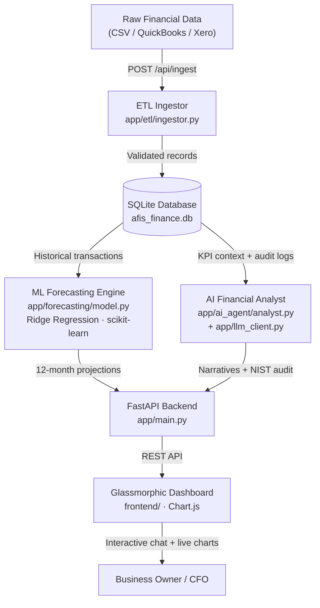

# AFIS — AI-Powered Financial Intelligence System

[](https://opensource.org/licenses/MIT)
[](https://www.python.org/)
[](https://fastapi.tiangolo.com/)
[](https://scikit-learn.org/)
[](https://airc.nist.gov/RMF)

> **a suite of open-source tools designed to empower Small and Medium Enterprises (SMEs) with AI-driven financial intelligence.**

AFIS is an open-source financial intelligence framework. It ingests raw transactional records, applies machine learning to project cash flow, and surfaces plain-English interpretations through an interactive AI Financial Analyst — running entirely on the business owner's machine, with zero cloud dependency and no recurring subscription cost.

---

## How It Works — Three Integrated Layers



### Layer 1 — Data Organization (ETL Ingestion)
Receives CSV exports from any accounting system. Validates schema, normalizes dates and currency formats, detects duplicates and statistical anomalies, logs every action to a NIST-aligned governance audit trail, and writes clean records to a local SQLite database.

```
Input:  QuickBooks export / Xero CSV / custom ledger
Output: Structured transactions table — validated, deduplicated, audit-logged
```

### Layer 2 — Predictive Analytics (ML Forecasting + BI Dashboards)
Trains Ridge regression models on the structured transaction history to produce 12-month projections of revenue, expenses, and net cash flow — each accompanied by 95% confidence intervals. Exposes burn rate, runway, net margin, and cash position via interactive Chart.js dashboards.

```
Input:  Structured financial database
Output: 12-month cash flow forecast · burn rate · runway · confidence bounds
```

### Layer 3 — AI Interpretation (Financial Analyst Agent)
Converts processed metrics into natural-language management narratives, flags financial red flags (low runway, negative margin, unusual burn), and provides actionable recommendations. Operates in two modes:
- **LLM Mode**: powered by Anthropic Claude for context-aware narrative generation
- **Offline Mode**: deterministic rule-based heuristics — no API key required

```
Input:  Computed KPIs and forecast results
Output: Plain-English narrative · risk flags · strategic recommendations
```

---

## Technical Architecture





### REST API Surface

| Endpoint | Method | Description |
|---|---|---|
| `/api/ingest` | `POST` | Upload CSV ledger — triggers ETL pipeline and model retraining |
| `/api/kpis` | `GET` | Current KPIs: cash balance, burn rate, runway, net margin |
| `/api/forecast` | `GET` | 12-month ML projections with confidence intervals |
| `/api/chat` | `POST` | Interactive query to the AI Financial Analyst |
| `/api/nist-audit` | `GET` | NIST AI RMF 1.0 audit checklist and governance logs |
| `/api/system/status` | `GET` | System status, AI mode (`llm` or `offline`), version |

### Stack

| Component | Technology |
|---|---|
| Backend | FastAPI (Python 3.10+) |
| ML Forecasting | scikit-learn · Ridge Regression · NumPy · pandas |
| Database | SQLite (zero-server, local-first) |
| AI Narrative | Anthropic Claude (optional) · rule-based offline fallback |
| Dashboard | HTML + CSS + JavaScript · Chart.js |
| Testing | pytest · httpx |
| Data format | CSV — compatible with QuickBooks, Xero, Wave exports |

---

## Key Design Decisions

**Local-first, privacy by design.** All transaction data stays on the SME's machine. The optional LLM integration transmits only computed financial metrics to the API — never raw transaction records.

**Zero-server dependency.** SQLite requires no database server. The entire stack starts with a single command.

**Works without an API key.** Every feature — ETL, forecasting, dashboards — operates in full in offline mode. The AI narrative layer degrades gracefully to deterministic heuristics.

**Provider-agnostic LLM layer.** `app/llm_client.py` abstracts the AI provider. Anthropic Claude is the reference implementation; any provider can be substituted.

**NIST AI RMF 1.0 alignment.** Every ETL action, model run, and AI interaction is logged to a persistent `audit_logs` table following NIST governance principles: validity, reliability, explainability, and human oversight.

---

## Who Is This For?

AFIS is built for owners and CFOs of small and medium enterprises who need financial intelligence without enterprise software costs — and for the accountants, bookkeepers, and BI consultants who serve them.

**You do not need a data science background.** Export your ledger from QuickBooks or Xero, drop in the CSV, and run `python run.py`. AFIS handles schema validation, model training, and interpretation.

---

## Quickstart

```bash
git clone https://github.com/Albertsfc/AFIS-Framework.git
cd AFIS-Framework/AFIS
pip install -r requirements.txt
python run.py
```

Open `http://localhost:8000/static/index.html` in your browser.

**Try it with sample data:** the system auto-seeds a synthetic 24-month transaction dataset (`AFIS/data/examples/sample_sme_transactions.csv`) — 421 transactions, ~$1.9M annual revenue, 9% net margin. The ML model trains on it immediately.

---

## AI Analysis Modes

**LLM Mode** — set the environment variable and restart:

```bash
# Linux/macOS
export ANTHROPIC_API_KEY=your_key_here

# Windows
set ANTHROPIC_API_KEY=your_key_here

python run.py
```

**Offline Mode** (default, no key required): rule-based financial heuristics generate structured analysis covering runway assessment, margin evaluation, and burn rate monitoring. All ETL, forecasting, and dashboard functionality is identical in both modes.

Check which mode is active:

```bash
curl http://localhost:8000/api/system/status
# {"status": "running", "ai_mode": "offline", "version": "0.2.0"}
```

---

## Getting Started

### Prerequisites
- Python 3.10 or higher
- Git

### Installation

```bash
# 1. Clone
git clone https://github.com/Albertsfc/AFIS-Framework.git
cd AFIS-Framework/AFIS

# 2. Create virtual environment
python -m venv venv
source venv/bin/activate   # Windows: venv\Scripts\activate

# 3. Install dependencies
pip install -r requirements.txt

# 4. (Optional) configure environment
cp .env.example .env
# Edit .env to add your ANTHROPIC_API_KEY if desired

# 5. Launch
python run.py
```

### Running Tests

```bash
pytest tests/ -v
```

---

## NIST AI RMF 1.0 Alignment

| NIST Function | AFIS Implementation |
|---|---|
| **GOVERN** | MIT License · open audit logs · `CONTRIBUTING.md` · traceable decision logic |
| **MAP** | Financial domain scoped to SME use cases · documented assumptions and limitations |
| **MEASURE** | Automated pytest suite · model residuals computed per run · anomaly detection in ETL |
| **MANAGE** | Offline fallback · duplicate/outlier flagging · `audit_logs` table · explainable Ridge model |

The AI Financial Analyst sends only computed aggregate metrics to the LLM API — never raw transaction data. This is enforced at the `app/llm_client.py` layer.

---

## Repository Structure

```
AFIS-Framework/
└── AFIS/
    ├── app/
    │   ├── main.py                  ← FastAPI app · route registration · static serving
    │   ├── llm_client.py            ← Provider-agnostic LLM client (Claude + offline fallback)
    │   ├── ai_agent/
    │   │   └── analyst.py           ← KPI computation · health report · chat Q&A
    │   ├── database/
    │   │   └── db_manager.py        ← SQLite connection · schema init · governance audit logging
    │   ├── etl/
    │   │   └── ingestor.py          ← CSV parsing · validation · duplicate detection · anomaly flagging
    │   └── forecasting/
    │       └── model.py             ← Ridge regression · 12-month projection · confidence intervals
    ├── data/
    │   └── examples/
    │       └── sample_sme_transactions.csv   ← 421-row synthetic dataset (24 months)
    ├── docs/
    │   ├── architecture.md          ← Detailed architecture and module responsibilities
    │   └── images/                  ← Architecture diagrams
    ├── frontend/
    │   ├── index.html               ← Dark-mode glassmorphic dashboard
    │   ├── styles.css               ← CSS grid layout
    │   └── app.js                   ← Chart.js charts · API calls · chat interface
    ├── tests/
    │   ├── conftest.py              ← Shared pytest fixtures
    │   ├── test_etl.py              ← ETL pipeline tests
    │   ├── test_forecast.py         ← ML forecasting tests
    │   └── test_api.py              ← FastAPI endpoint tests
    ├── .env.example                 ← Environment variable template
    ├── CHANGELOG.md                 ← Full release history
    ├── CONTRIBUTING.md              ← Contribution guide
    ├── LICENSE                      ← MIT License
    ├── requirements.txt
    └── run.py                       ← Single-command launcher with .env auto-load
```

---

## Contributing

See [AFIS/CONTRIBUTING.md](AFIS/CONTRIBUTING.md) for guidelines on reporting issues, submitting code, and contributing datasets.

Areas where help is most needed:
- ETL connectors for additional accounting formats (Xero XML, Wave CSV, FreshBooks)
- Additional ML models for highly seasonal businesses (Prophet, LSTM)
- Docker Compose setup for zero-dependency deployment
- Localization for Spanish-speaking SME owners

---

## Changelog

See [AFIS/CHANGELOG.md](AFIS/CHANGELOG.md) for the full release history.

### Latest: v0.2.1
- Finalized README, updated badges, and revised architecture documentation

---

## License

MIT License — see [AFIS/LICENSE](AFIS/LICENSE) for details. Free to use, adapt, and redistribute.
