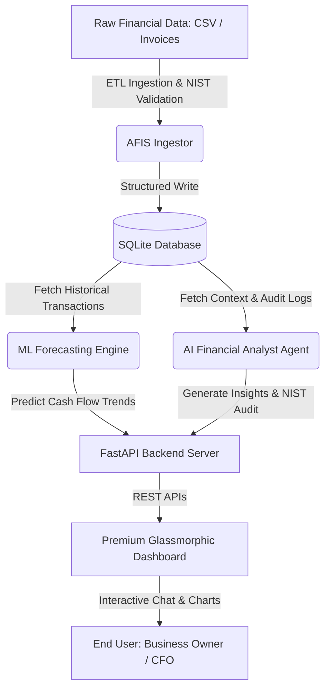

# AFIS: AI-Powered Financial Intelligence System

[](https://opensource.org/licenses/MIT)
[](https://www.python.org/)

AFIS (Advanced Financial Intelligence System) is a state-of-the-art, open-source financial technology framework designed to empower Small and Medium Enterprises (SMEs) across the United States. AFIS helps companies mitigate cash flow risks, automate financial controllership, and enhance survival rates through an integrated pipeline of automated ETL ingestion, Machine Learning forecasting, and cognitive AI-powered financial auditing.

---

## 🏗️ Technical Architecture

AFIS combines data engineering, machine learning, and natural language processing to deliver interactive business intelligence:



---

## 🌟 Key Features

1. **Automated ETL Ingestion**: Ingests financial transactional data, formats dates and currencies, checks for anomalous entries (duplicates, outliers), and logs database status.
2. **Machine Learning Cash Flow Forecasting**: Trains a regression-based predictive model using scikit-learn on historical transaction sequences to project the next 12 months of revenues, expenses, and net cash flow with confidence boundaries.
3. **Cognitive AI Financial Analyst**: An interactive AI Agent acting as a virtual CFO. It computes critical metrics (Burn Rate, Runway in months, Net Profit Margin), flags financial red flags, and provides actionable strategic advice.
4. **NIST AI RMF 1.0 Compliance Framework**: Integrated logging and safety audits verifying data integrity, model fairness, transparency, and explanation validity, complying with federal guidelines.
5. **Premium Web Dashboard**: A visual interface utilizing modern dark-mode glassmorphism, responsive CSS grid layouts, and interactive Chart.js visualizations.

---

## 🚀 Getting Started

### Prerequisites
- Python 3.10 or higher
- Git

### Installation

1. **Clone the repository**:
   ```bash
   git clone https://github.com/yourusername/afis-core.git
   cd afis-core
   ```

2. **Create a virtual environment**:
   ```bash
   python -m venv venv
   source venv/bin/activate  # On Windows: venv\Scripts\activate
   ```

3. **Install dependencies**:
   ```bash
   pip install -r requirements.txt
   ```

### Running the Application

1. **Launch the FastAPI Server & Dashboard**:
   ```bash
   python run.py
   ```
2. **Access the Web Interface**:
   Open your browser and navigate to `http://localhost:8000/static/index.html` to explore the dashboard.

---

## 🔒 NIST AI RMF 1.0 Compliance

AFIS is developed under the guidelines of the **NIST AI Risk Management Framework (NIST AI RMF 1.0)**, implementing:
- **Validity & Reliability**: Rigorous ETL constraints to reject corrupt or poisoned financial records.
- **Explainability & Transparency**: Open-source ML algorithms and traceable rule pathways for AI Agent decisions.
- **Accountability & Auditability**: Persistent database logs of all ETL actions, model drift parameters, and AI interactions.

---

## 📄 License

This project is licensed under the MIT License - see the [LICENSE](LICENSE) file for details.
