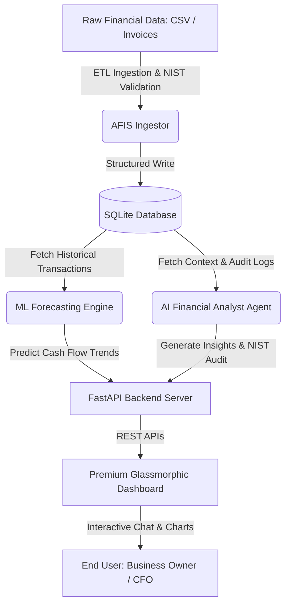

# AFIS: AI-Powered Financial Intelligence System

[](https://opensource.org/licenses/MIT)
[](https://www.python.org/)
[](https://fastapi.tiangolo.com/)
[](https://airc.nist.gov/RMF)

AFIS (Advanced Financial Intelligence System) is a state-of-the-art, open-source financial technology framework designed to empower Small and Medium Enterprises (SMEs) across the United States. AFIS helps companies mitigate cash flow risks, automate financial controllership, and enhance survival rates through an integrated pipeline of automated ETL ingestion, Machine Learning forecasting, and cognitive AI-powered financial auditing.

---

## 🏗️ Technical Architecture

AFIS combines data engineering, machine learning, and natural language processing to deliver interactive business intelligence:



---

## Who Is This For?

AFIS is built for owners and CFOs of U.S. small and medium enterprises (SMEs) who need
actionable financial intelligence without the cost of enterprise software.

**You do not need a data science background.** Clone the repo, install dependencies,
drop in your CSV export from QuickBooks or Xero, and run `python run.py`.

The system handles the rest: data validation, forecasting, and natural-language
interpretation of your financial position.

---

## 🌟 Key Features

1. **Automated ETL Ingestion**: Ingests financial transactional data, formats dates and currencies, checks for anomalous entries (duplicates, outliers), and logs database status.
2. **Machine Learning Cash Flow Forecasting**: Trains a regression-based predictive model using scikit-learn on historical transaction sequences to project the next 12 months of revenues, expenses, and net cash flow with confidence boundaries.
3. **Cognitive AI Financial Analyst**: An interactive AI Agent acting as a virtual CFO. It computes critical metrics (Burn Rate, Runway in months, Net Profit Margin), flags financial red flags, and provides actionable strategic advice.
4. **NIST AI RMF 1.0 Compliance Framework**: Integrated logging and safety audits verifying data integrity, model fairness, transparency, and explanation validity, complying with federal guidelines.
5. **Premium Web Dashboard**: A visual interface utilizing modern dark-mode glassmorphism, responsive CSS grid layouts, and interactive Chart.js visualizations.

---

## Quickstart

```bash
git clone https://github.com/Albertsfc/AFIS-Core-Framework.git
cd AFIS-Core-Framework
pip install -r requirements.txt
python run.py
```

Then open `http://localhost:8000/static/index.html` in your browser.

To try it immediately with sample data, the system will auto-load
`data/examples/sample_sme_transactions.csv` if no database is found.

---

## AI Analysis Modes

AFIS supports two analysis modes:

**LLM Mode** (requires API key): The AI Financial Analyst uses Claude to generate
natural-language interpretations of your financial position.

```bash
export ANTHROPIC_API_KEY=your_key_here
python run.py
```

**Offline Mode** (default, no API key needed): The system uses rule-based
financial heuristics to generate structured analysis. All ETL, forecasting,
and dashboard features work identically in both modes.

---

## 🚀 Getting Started

### Prerequisites
- Python 3.10 or higher
- Git

### Installation

1. **Clone the repository**:
   ```bash
   git clone https://github.com/Albertsfc/AFIS-Core-Framework.git
   cd AFIS-Core-Framework
   ```

2. **Create a virtual environment**:
   ```bash
   python -m venv venv
   source venv/bin/activate  # On Windows: venv\Scripts\activate
   ```

3. **Install dependencies**:
   ```bash
   pip install -r requirements.txt
   ```

### Running the Application

1. **Launch the FastAPI Server & Dashboard**:
   ```bash
   python run.py
   ```
2. **Access the Web Interface**:
   Open your browser and navigate to `http://localhost:8000/static/index.html` to explore the dashboard.

---

## 🔒 NIST AI RMF 1.0 Compliance

AFIS is developed under the guidelines of the **NIST AI Risk Management Framework (NIST AI RMF 1.0)**, implementing:
- **Validity & Reliability**: Rigorous ETL constraints to reject corrupt or poisoned financial records.
- **Explainability & Transparency**: Open-source ML algorithms and traceable rule pathways for AI Agent decisions.
- **Accountability & Auditability**: Persistent database logs of all ETL actions, model drift parameters, and AI interactions.

---

## 📄 License

This project is licensed under the MIT License - see the [LICENSE](LICENSE) file for details.
